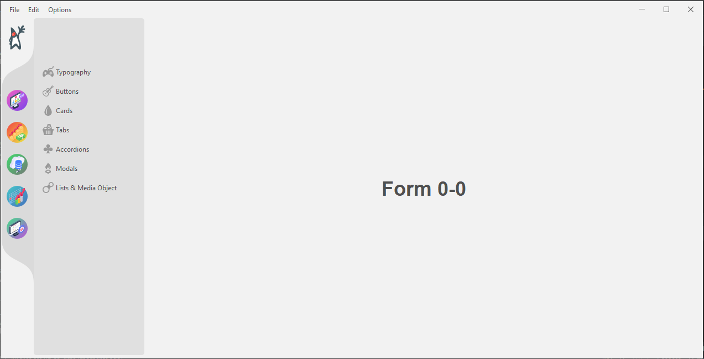
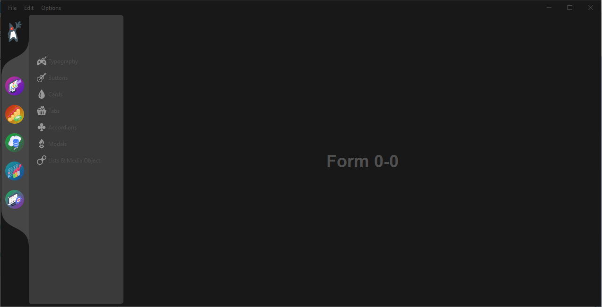

# flatgui-javaswing

This is a sample application that use FlatLaf - Flat Look and Feel library,
for modern java swing UI layout.

Library use on this projects:

1. FlatLaf and FlatLaf Extras
2. MigLayout Swing
3. Timingframework

[FlatLaf link](https://www.formdev.com/flatlaf/)

FlatLaf Themes

To be able to use theme chooser, you have to install
FlatLaf Extras, this is maven library :

```xml
<dependency>
    <groupId>com.formdev</groupId>
    <artifactId>flatlaf-extras</artifactId>
    <version>${flatlaf.version}</version>
</dependency>
```
And add this to action listener, see (MainFrame.java):

```java
 if (chDarkMode.isSelected()) {
    EventQueue.invokeLater(() -> {
        FlatAnimatedLafChange.showSnapshot();
        FlatDarculaLaf.setup();
        FlatLaf.updateUI();
        FlatAnimatedLafChange.hideSnapshotWithAnimation();
    });
} else {
    EventQueue.invokeLater(() -> {
        FlatAnimatedLafChange.showSnapshot();
        FlatIntelliJLaf.setup();
        FlatLaf.updateUI();
        FlatAnimatedLafChange.hideSnapshotWithAnimation();
    });
}
```

Light Themes



Dark Themes


